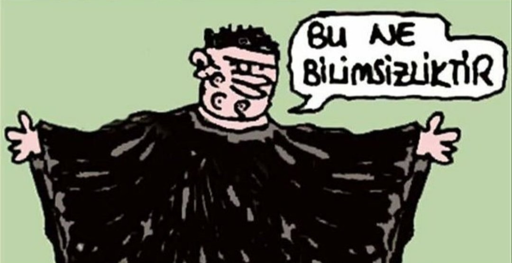
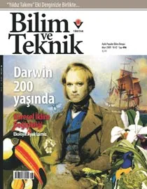

Zaman makinamızı alıp 2009 senesine bir yolculuk yapalım.  Konumuz hepimizin çok sevdiği, ve zevk alarak okuduğu Bilim ve Teknik dergisi, ve 2009 senesinde bu dergide yaşanan kötü olaylar. Herkese ["Bu ne bilimsizliktir!"](bunebilimsizliktir.github.io) dedirten bir olay.

# 2009 senesinde Bilim ve Teknik dergisine Darwin sansürü

Bazen öyle anlar olur ki Umut Sarıkaya'nın "Bu ne bilimsizliktir!" serzenişi cuk diye oturur.
2009 senesinde Bilim ve Teknik dergisinin Mart sayısının sansürlenmesine sebep olan Darwin krizi bu anlardan birisi.
Ve krizin baş aktörü (dönemin) Tübitak başkan yardımcısı [Ömer Ziya Cebeci](https://eksisozluk.com/omer-cebeci--1552177) de adeta Umut Sarıkaya karikatürlerinden fırlamış bir karakter.
Neyse ki bu Ömer Cebeci bey artık Tübitak'da değil, bu olaydan (belki de bu olayın da etkisiyle) 2 sene sonra görevden alındı.
Bu komik olayı anmak, ve yaşanan absürtlükleri unutmamak için bu sayfada dönemden kaynakları toparlamaya çalıştım.

Bu absürt hadise sadece bilim tarihimizde kara bir leke olmadı, aynı zamanda ileride ülkemizin canını çok yakacak olan Fethullahçı kadrolaşmanın da erken bir habercisiydi, bir uyarı sinyaliydi.

## 2009 senesinde Bilim ve Teknik Dergisi'nde neler yaşandı?

2009 senesi Charles Darwin'in doğumunun 200'üncü yıldönümü, ve "[Origin of Species](https://en.wikipedia.org/wiki/On_the_Origin_of_Species)" kitabının basılmasının 150. yıldönümüdür.  Bu nedenle 2009 senesinde bütün dünyada evrim ve Darwin konulu etkinlikler yapılır, [mesela burada birkaç tanesini okuyabilirsiniz](https://darwin-online.org.uk/2009.html).

Türkiye'de de Bilim ve Teknik dergisi 2009 Mart sayısını Evrim Teorisi'ne ayırıp kapağa Charles Darwin'i koyar.  Daha sonra sansürlenecek olan kapak budur:

Fakat o dönem devletteki Fethullaçı kadrolaşmanın zirvede olduğu, suç örgütü lideri [Harun Yahya yani Adnan Oktar](https://tr.wikipedia.org/wiki/Adnan_Oktar)'ın "Evrim Aldatamacası" diye yazılar bastırıp devlet büyüklerine gönderdiği dönemdir.  Zamanın bilim ve teknoloji düşmanı ruhuna uygun davranan bir bürokrat da çıkar: [Tübitak başkan yardımcısı Ömer Ziya Cebeci](https://eksisozluk.com/omer-cebeci--1552177).

Ömer Ziya Cebeci önce Darwin'li kapağı sansürler, sonra da Bilim ve Teknik Dergisi'ndeki yöneticileri cezalandırır ve işten atar.

Bunları yapan Ömer Ziya Cebeci merak edilesi bir karakter.  [Kendisinin yaptığı bilimsel çalışmaların listesi burada](https://scholar.google.com/citations?user=PCNbQu4AAAAJ&hl=de&oi=ao).   Görebileceğiniz üzere kariyeri boyunca pek bilimsel çalışma yapmamış.   Makale ve atıf sayısı çok az.  Zaten az sayıda olan makalelerinde kayda değer bir başarı veya buluş yok.  Türkiye'de ortalama bir akademisyenin çok daha fazla bilimsel çalışması vardır. Tübitak başkan yardımcılığına nasıl geldiği tam bir muamma.  Bilimsel başarıları sayesinde olmadığı kesin.  Kendisinin patronu ve dönemin Tübitak başkanı olan [Nüket Yetiş](https://tr.wikipedia.org/wiki/N%C3%BCket_Yeti%C5%9F) daha da fena.  Neredeyse hiçbir bilimsel çalışma yapmadan Tübitak başkanı olmuş.  Bu CV'lere bakınca 2009 senesinde yaşanan bilimsizliğin kaynağının ne olduğu hemen görülüyor.

Bu vahim olay hakkında yazılmış çok fazla haber var.  Bulabildiklerimi toparlamaya çalıştım:

- [Hürriyet: "Bilim ve Teknik’te Darwin skandalı"](https://www.hurriyet.com.tr/gundem/bilim-ve-teknik-te-darwin-skandali-11173176)
- [Köksal Toptan: "Yapılan yanlış"](https://www.milliyet.com.tr/gundem/koksal-toptan-yapilan-yanlis-1069929)
- [CNNTürk: "Toptan TÜBİTAK yönetimini uyardı"](https://www.cnnturk.com/turkiye/toptan-tubitak-yonetimini-uyardi-147363)
- [CNN Türk: "Bilim Dünyası Ayakta"](https://www.cnnturk.com/video/dunya/bilim-dunyasi-ayakta-361650)
- [T24: "TÜBİTAK’ta kılıçlar çekildi"](https://t24.com.tr/haber/tubitakta-kiliclar-cekildi,34560)
- [Tıp Dünyası: "Darwin sansürü'nün iç yüzü"](https://www.ttb.org.tr/TD/TD163/index.pdf)
- [Eczacılar Odası: "Tübitak Bilime Sansür Uygulamıştır!"](https://www.izmireczaciodasi.org.tr/duyuru/basin-aciklamasi-1474)
- [Bianet: "TÜBİTAK Darwin'i Sansürledi, Bilim Çevresi Tepkili"](https://bianet.org/haber/tubitak-darwin-i-sansurledi-bilim-cevresi-tepkili-113046)
- ['Darwin' nedeniyle kariyeri bitti, hukuk savaşını kazandı](https://haber.sol.org.tr/devlet-ve-siyaset/darwin-nedeniyle-kariyeri-bitti-hukuk-savasini-kazandi-haberi-77283)
- [Seyrüsefer Günlüğü: "Bilim ve Teknik dergisindeki sansür"](https://www.seyrusefer.com/bilim-ve-teknik-dergisindeki-sansur/)

Ekşisözlük'te de bu vahim hadise hakkındaki açılmış çok sayıda başlık var:
- [bilim ve teknik'te darwin'e sansür](https://eksisozluk.com/bilim-ve-teknikte-darwine-sansur--2080238)
- [ömer ziya cebeci](https://eksisozluk.com/omer-cebeci--1552177)
- [13 mart 2009 odtü devrim stadyumu evrim eylemi](https://eksisozluk.com/13-mart-2009-odtu-devrim-stadyumu-evrim-eylemi--2082150)

## Sansüre Türkiye'den tepkiler

Cebeci'nin sansürü Türkiye'de çok tepki görür.  Üniversite öğrencileri Tübitak önünde protesto yapar.  "Bilim Düşmanı Cebeci istifa" ve "Tübitak'da Harun Yahya istemiyoruz" sloganları atılır.  Hatta AKP içinden bile çok sert tepkiler gelir.  Dönemin AKP'li TBMM başkanı ve bugün hala Cumhurbaşkanı İstişare Kurulu üyesi olan [AKP'li siyasetçi Köksal Toptan, Tübitak'ı ve Ömer Cebeci'yi sert bir şekilde eleştirmiştir](https://www.milliyet.com.tr/gundem/koksal-toptan-yapilan-yanlis-1069929).

<video width="500" controls>
  <source src="sansure_tepkiler.mp4" type="video/mp4">
</video>

<video width="500" controls>
  <source src="sansur.mp4" type="video/mp4">
</video>

  

Fakat sansüre en yaratıcı ve mizahi tepki ODTÜ'lü öğrencilerden gelir.  13 Mart 2009 günü [ODTÜ Devrim Stadyumu](https://tr.wikipedia.org/wiki/Devrim_Stadyumu)'nda toplanan öğrenciler [DEVRİM yazısındaki 'D' harfini kapatıp EVRİM yaparlar](https://eksisozluk.com/13-mart-2009-odtu-devrim-stadyumu-evrim-eylemi--2082150).

<video width="500" controls>
  <source src="odtu_ntv.mp4" type="video/mp4">
</video>

<video width="500" controls>
  <source src="odtu2.mp4" type="video/mp4">
</video>

  

Konuyu en detaylı inceleyen ve tepki gösteren kişilerden birisi de eksisozluk.com kurucusu **ssg**'dir.  [İlgili entry'ler buradadır](https://eksisozluk.com/bilim-ve-teknikte-darwine-sansur--2080238?a=search&author=ssg).

## Sansüre Uluslararası tepkiler

Sansür bütün dünyada haber olur.  Bunlardan en çarpıcısı, dünyanın en prestijli bilimsel dergilerinden Nature bu sansür rezaleti hakkında bir yazı yayınlar.  "[Turkey censors evolution](https://www.nature.com/articles/458259a)" (Türkiye Evrim'i sansürler) başlığı ile çıkan yazıda Tübitak eleştirilir.

Olaya uluslararası basından gelen tepkileri aşağıda toplarladım:

- [Nature: Turkey censors evolution](https://www.nature.com/articles/458259a)
- [Huffington Post: Turkey's Science Board Censors Darwin](https://www.huffpost.com/entry/turkeys-science-board-cen_n_175442)
- [American Physical Society: Evolution Stirs Tempest in Turkish Teapot](https://www.aps.org/archives/publications/apsnews/200905/evolution.cfm)
- [Süddeutsche Zeitung: Darwin-Skandal](https://www.sueddeutsche.de/wissen/darwin-in-der-tuerkei-eine-kreation-provoziert-1.387717)

## Kıssadan hisse

Müslümanların ve İslam Dünyası'nın Evrim Teorisi ve Charles Darwin ile bir sorunu yoktur.
Bunlar herkesin kabul ettiği bilimsel gerçeklerdir.
Sorunu olanlar Amerikan Hristiyan Evangelistlere özenip, Amerika'dan Türkiye'ye sahte gündem ithal etmek isteyen Fethullahçılar ve Adnancılar gibi suç odaklarıdır.
Zaten hem AKP hem de muhalefet 2009 senesindeki bu absürt sansüre tepki göstermiştir.

Bu tür olaylar liyakatsiz, başarısız insanların yönetici makamlara getirilmesi yüzünden olur.
Başarıları ile öne çıkamayan insanlar tribünlere oynamak için böyle sahte popülist gündemler oluştururlar.
Umarım 2009 senesindeki bu vahim olaydan gerekli dersler çıkarılır, ve tekrar benzer olaylar yaşanmaz.
Çünkü ülkemiz daha iyisini hak ediyor.

**14 Ocak 2017**

